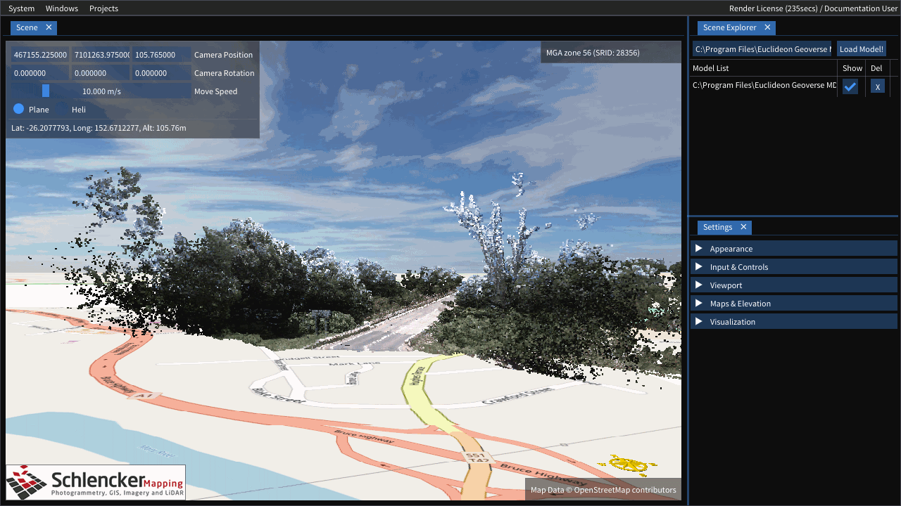

# Euclideon Vault Client User Guide

## The Basics
### Unpacking / Installing

#### Windows
1. Download the latest ZIP that has been approved for use from your Euclideon Vault Server provider.
2. Unpack the entire contents of the zip
3. If you have a computer capable of running DirectX 11 run `vaultClient_d3d11.exe` otherwise for older machines `vaultClient.exe`. The DirectX 11 version will offer a smoother experience on most machines.

#### macOS
1. Download the latest DMG package that has been approved for use from your Euclideon Vault Server provider.
2. Open the DMG and drag the "Euclideon Vault Client" icon onto the provided "Applications" icon
4. Run the "Euclient Vault Client" application from "Applications"

#### Debian Linux Distributions (Requires Desktop Environment)
1. Use your package manager to install the following:
    - SDL2 (Minimum version 2.0.5)
    - libCURL (latest)
2. Download the latest tar.gz that has been approved for use from your Euclideon Vault Server provider.
3. Unpack the entire contents of the tar.gz
4. Run `vaultClient`

#### iOS / Android
- The iOS and Android builds are not currently publicly available.

### Logging In
After running the application you should see a login screen as below.

- `ServerURL` will be provided by your vault server provider*
- `Username` is the username you were given (or entered while registering). If you weren't provided with a username you may be able to register for one by visiting the server URL in your browser*
- `Password` is your account password

There are additional settings in the "Advanced Connection Settings" dropdown.

- `Proxy Address` is the address for your internet proxy (this is provided by your system administrator). It can additionally include the port number and protocol. Examples include: `192.168.0.1`, `169.123.123.1:80` or `https://10.4.0.1:8081`. Leaving this blank will attempt auto-detection.
- `Ignore Certificate Verification` will disable verification of the PEER and HOST certificate authorities. This setting should *ONLY* be used when instructed by your system administrator and only when errors are occuring during the login process. It will weaken the security between your computer and the Euclideon Vault Server.

> NOTE: `Ignore Certificate Verification` will not be saved due to the security risk associated. You will need to enable this setting each time you open the application.

*`Remember` will store the value you enter here for future use so you don't have to enter it every time.

After logging in you should see the full user interface:

---

## User Interface

### 1. Scene Viewport
The scene viewport displays your scene (the Scene Explorer (see below) explains how to add things to the scene).

#### Moving around the viewport
> TIP: These settings are configurable in the [Input & Controls](#input-&-controls) settings menu

Mouse Controls:
- Holding the left mouse button down and moving the mouse will "tumble" (Turning without moving) the camera.
- Holding the right mouse button down on a point in the scene (not the skybox) will begin "panning" (moving the camera, but not turning it) the camera. It will keep the originally hovered point _under the mouse cursor_.
- Holding the middle mouse button down on a point in the scene (not the skybox) will begin "orbitting" (keeping the camera the same distance from the point by turning and moving the camera) the selected point. It will keep the originally hovered point _at the same place on the screen_.
- The scroll wheel will "dolly" (move the camera in and out) from the hovered point (not the skybox).
  > TIP: If you prefer scroll wheel to change the move speed like Euclideon Geoverse MDM does, that option is available in the settings as well.

Default Keyboard Controls (with the "Scene" window focussed):
- `W` and `S` strafe the camera forward and backward at the current Camera Move Speed
- `A` and `D` strafe the camera left and right at the current Camera Move Speed
- `R` and `F` strafe the camera up and down at the current Camera Move Speed
- `Spacebar` swaps between "Plane" and "Heli" modes

### 2. Menu & Status Bar
The menu bar consists of 2 sections, the left section with menu drop downs and the right section with status information.

#### System Menu
The system menu has a number of system related functions.

- "Logout" terminates your current session with the server. This is a security feature to prevent attackers from hijacking your session. It also takes you back to the login screen in case you want to change users or servers.
  > TIP: Logout does not unlock your current licenses for use by other users, they must still time out.
- "Restore Defaults" resets _all_ settings back to how they were when you ran Euclideon Vault Client the first time.
- "About" displays a popup with the version and license information for the current version of Client.
- "Quit" logs you out and then closes the program.

#### Windows
The windows menu allows you to show or hide various windows in the Euclideon Vault Client application.

#### Projects
The projects menu has a new scene button and if additional projects are available to your user, it will show those projects here as well.

- "New Scene" will remove all items from your Scene

#### Status Bar
The status bar shows a lot of useful information (not all of it will always be available).

- Number of files queued to load "([n] Files Queued),

### 3. Scene Explorer
This pane shows you the assets currently in your scene.

> TIP: If you ever want to quickly clear the current scene, the "Projects" menu has a "New Scene" button that will remove everything from the scene.

#### Loading UDS Models
There are a number of ways to add models to the scene.

1. Drag and Drop: On devices with folder exploring you can drag a file from your file exporer and drop it in the Euclideon Vault Client window to add the model to the scene.
2. Direct URI loading: You can type a url or path into the input box beside "Load Model" in the "Scene Explorer" tab and then click the "Load Model" button.
3. If you have access to projects on the server you will be able to click the "Projects" button in the menu and select a project to load. Projects are defined from the Vault Server you're connected to.

### 4. Settings
This pane allows you to change a number of settings

> TIP: If you ever change a setting and can't recall what you've changed, you can reset _all_ settings by going to the "System" menu and selecting "Restore Default"

You can reset individual categories of settings by right clicking a heading in the "Settings" tab and selecting "Restore Defaults".

#### Settings Keys
- `F5` to enter presentation mode, in this mode the scene becomes fullscreen and optionally hides the overlays on the scene, depending on the "Responsive UI" setting.

The "Presentation UI" settings determine whether to show overlays on the Scene tab in presentation mode, the options are "Show", "Hide" or "Responsive" which will show the overlays until you don't move the mouse for 3 seconds.

### 5. Watermark
???

### 6. Camera Information
???

### 7. GIS / Scene Info
???

### 8. Copyright Info & Compass
???

### 9. Convert Tab
Converting pointclouds to the UDS file format can be done from within the Euclideon Vault Client as well. Loading a supported pointcloud format will open the "Convert" window if it isn't already open. A quick 'pre-parse' is done to detect the file format, supported attributes etc. by loading the start of the file, this stage also does an estimate of the total number of points the file has.

> If you aren't able to find the convert tab, it can be opened from the `Windows > Convert` flag.

There are a few additional settings to modify here.

- Output name
  - This is the final name and path of the exported UDS file
  - Ideally this should be the target location of the file so that you don't need to copy the file at the end. Make sure there is enough space in the target directory to store the entire file that will be output.
- Temp Directory
  - Defaults to beside the Output file but should ideally be on a high speed local drive.
  - A lot of small files will be written here for a short period of time during conversion so make sure you have enough disk space to store the files, a good rule of thumb is that the temporary directory uses about as much space as the uncompressed raw inputs do as the points in the temporary files aren't compressed yet.
- Continue processing after corrupt/incomplete data (where possible) [Defaults to Off]
  - If corruption or incomplete data is detected during a conversion this setting will decide wheather the conversion gets cancelled (off) or continues, skipping the corrupted points.
- Point Resolution [Defaults to 0.01 and then source size]
  - This settting determines the size of the points (in meters) in the pointcloud after conversion.
  - It will attempt to find a good size based on the source data and can also be set manually by first checking the "Override" checkbox and then typing in the text field
- SRID [Defaults to 0]
  - The SRID is the ID of the GIS zone for the exported model.
  - Usually the source data will have information about what zone the data is stored in, search for "EPSG code" or "SRID code" in the meta data.
  - If the pre-parse can detect the SRID it will set it here as well and can also be set manually by first checking the "Override" checkbox and then typing in the text field
  - It assumes that the input is already in the correct zone and does not currently do a conversion.
- Input Files
  - Expanding this will give you the list of files that will be merged together into the new UDS
  - The estimated number of points in each file will be shown. During conversion the progress for each file will also be shown.

After clicking "Begin Convert" it will start converting. You can keep track of progress on the convert tab, go back to working in the scene tab or prepare another conversion that will begin as soon as the first convert completes.

The "X" button beside the convert job in the "Convert Jobs" section allows you to cancel a running convert (it will cancel at the next 'safe' point to do so and clean up temporary files). After a job has completed the "X" button also allows you to remove it from the list. A successful conversion will also have an "Add to Scene" button that adds the converted UDS to the existing scene.

> We do not recommend running multiple converts at the same time. Converting is a memory and processor intensive process so it's almost always faster to have 1 convert running at a time. Euclideon Vault Client helps with this by allowing you to queue multiple jobs to run one after another.

---

## Technical Information

### Requirements

???

### Settings On Disk
Where the settings file is stored depends on your OS.
- Windows: `%AppData%/Euclideon/client/settings.json`
- macOS: `???`
- Linux: `???`
- iOS: `???`
- Android: `???`

The default settings are loaded from the file "defaultsettings.json" in the same directory as client.

## FAQs

???
