# Euclideon Vault Client 
# Quick Start Guide for Earth subscribers

## Contents 

- [**Purpose of this guide**](#purpose-of-this-guide)
- [**Downloading the Euclideon Vault Client software**](#downloading-the-euclideon-vault-client-software)
- [**Unpacking and Installing**](#unpacking-and-installing)
- [**Logging into Vault Client**](#logging-into-vault-client)
- [**Vault Client Interface**](#vault-client-interface)
  - [**1. Menu and Status Bar**](#menu-and-status-bar)
    - [**System Menu**](#system-menu)
    - [**Windows Menu**](#windows-menu)
    - [**Projects Menu**](#projects-menu)
  - [**2. Scene Viewport**](#scene-viewport)
    - [**Default Mouse Controls**](#default-mouse-controls)
    - [**Default Keyboard Controls**](#default-keyboard-controls)
  - [**3. Scene Explorer**](#scene-explorer)
    - [**Loading existing UDS Models**](#loading-existing-uds-models)
    - [**Loading a sample project**](#loading-a-sample-project)
  - [**4. Settings**](#settings)
  - [**5. Convert**](#convert)
- [**Hosting a model**](#hosting-a-model)
- [**Euclideon Vault Development Kit**](#euclideon-vault-development-kit)
- [**Contact Us**](#contact-us)
- [**Special Acknowledgements**](#special-acknowledgements) 

\newpage

## Purpose of this Guide
This Quick Start guide provides the information that Earth subscribers (those who have been granted access to Euclideon's *Earth* server) need to start using Euclideon's Vault Client application. Euclideon currently hosts several Vault Servers&mdash;the first iteration is called *Earth*, succeeded by *Mars*, *Jupiter*, and so on in the future, and is accessed by a specific Server URL.   

The Vault Server controls and issues licenses to the Vault Client for rendering and converting models and grants access to projects, but it does not store any model datasets. In most cases, you can host the Vault Server over an internet connection; however, it can also reside on an organisation's internal network.

Before starting, please ensure you received an email from Euclideon with a software download link and login credentials. For the purpose of this guide, you will connect to Earth server: https://earth.vault.euclideon.com/.  If you have any questions or suggestions, please contact Euclideon at <info@euclideon.com> or go to <https://www.euclideon.com/> to access our online support.

Refer to the [**Euclideon Vault Client User Guide**](./UserGuide.md) for detailed coverage of the Euclideon Vault Client interface.

## Downloading the Euclideon Vault client software

To use Euclideon Vault, you will need to download the Euclideon Vault Client software for your respective operating system.

| Step | Action |
| :--- | :------------------------- |
| 1. | Click on the link provided in the email that Euclideon sent: [https://earth.vault.euclideon.com/](https://earth.vault.euclideon.com) |
| 2.| If this is your first time downloading the Euclideon Vault Client software, then **Login using the credentials provided in the email from the previous step**.  Otherwise, login using your existing credentials.|
| 3. |Change your password from the temporary one Euclideon gave you by clicking on your **Username** in the top right-hand corner of the window and choosing **Change Password**.  |
| 4. | The packages screen lists the latest Euclidon Vault Client software version.   Click on **Download** for your operating system.       |
| 5. | If you do not see the version that has been approved for use from your Euclideon Vault Server provider, then **Click on Packages** on the top  menu.|
| 6. | Select **Download** for your version and operating system.   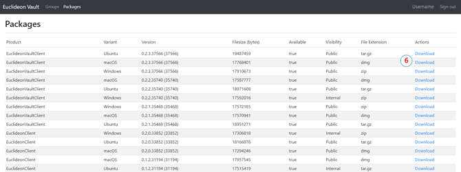   |
| 7. | Select the location to download the EuclideonVaultClient\_OS\_version.zip file.|
| 8. | Click **Save** to download to your default download location defined by your browser, or   Click the up arrow next to **Save** to select **Save As** to select another download location.|
| 9. | Change to the directory where you downloaded the file.|
| 10. |Go to [Unpacking and Installing](#unpacking-and-installing) for specific installation instructions on your operating system.|
 

## Unpacking and Installing

### Windows

1.	If you haven't already, change to the directory where you [downloaded](#downloading-the-euclideon-vault-client-software) the Euclideon Vault Client software. 
2.	Right-click on the `EuclideonVaultClient\_OS\_version.zip` file and select **Extract Here** to unpack the files to the current directory.
3.	If you have a computer capable of running OpenGL, then run \(double-click\) `vaultClient_OpenGL.exe`.  Otherwise, run \(double-click\) `vaultClient.exe`. 

### macOS

1.	Locate the Euclideon Vault Client DMG package that you [downloaded](#downloading-the-euclideon-vault-client-software) previously. 
2.	Open the DMG and drag the "Euclideon Vault Client" icon onto the provided "Applications" icon.
3.	Run the "Euclideon Vault Client" application from "Applications".

### Ubuntu Linux Distributions

Using this package requires a desktop environment.

1.	Use your package manager to install the following:
    -	SDL2 (Minimum version 2.0.5) 
    -	libCURL (Version 3) 
2.	Locate the Euclideon Vault Client tar.gz package that you [downloaded](#downloading-the-euclideon-vault-client-software) previously. 
3.	Unpack the entire contents of the tar.gz
4.	Type `./vaultClient` or double-click on `vaultClient` to initiate the Euclideon Vault Client interface.

### iOS and Android
The iOS and Android builds are not currently publicly available.

## Logging into Vault Client

Before attempting to log into the Euclideon Vault Client, ensure you have [downloaded and extracted the Euclideon Vault Client software](#quick-start-guide-for-euclideon-vault-client).

The remaining instructions in this guide target Windows operating systems. Refer to the [**Euclideon Vault User Guide**](./UserGuide.md) for detailed information relating to the other supported operating system types.

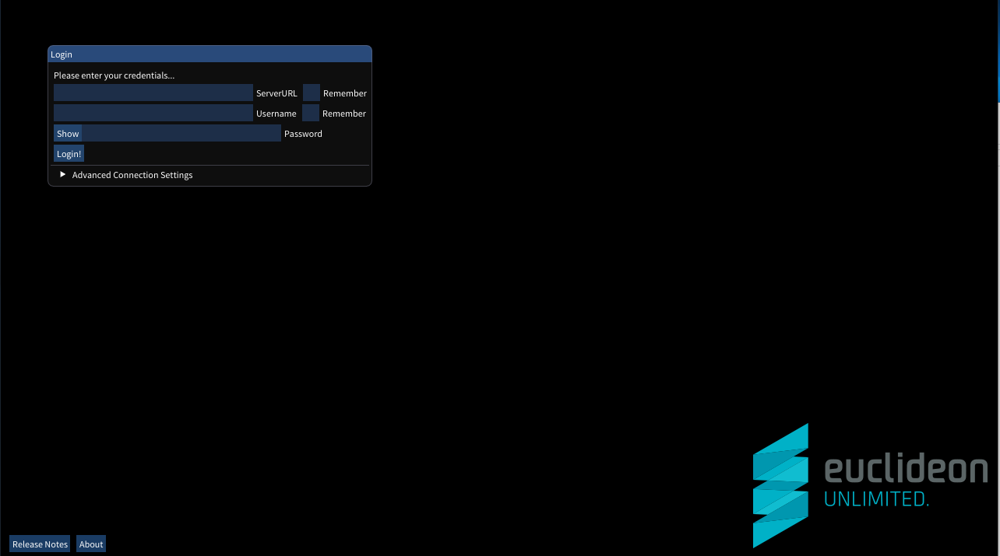

| Parameter | Description |
| :--- | :-----------------------  |
|**ServerURL**| Will be provided by your Euclidon Vault Server provider.|
|**Username** |The username you were given (or entered while registering). If you weren't provided with a username you may be able to register for one by visiting the server URL in your browser.   TIP: If `Remember` is ticked, the client will store the value entered so you don't have to enter it every time.|
|**Password** |Your account password. |

There are also additional settings in the **Advanced Connection Settings** dropdown:

| Parameter | Description |
| :--- | :-----------------------  |
|**Proxy Address** | The address for your internet proxy (this is provided by your system administrator).  It can additionally include the port number and protocol.  Examples include: `192.168.0.1`, `169.123.123.1:80` or `https://10.4.0.1:8081`. Leaving this blank will attempt auto-detection. |
|**User Agent** | A field included in HTTP request headers. Very few users will need to specify this setting. |
|**Ignore Certificate Verification** | Will disable verification of the PEER and HOST certificate authorities.  This setting should **only** be used when instructed by your system administrator and only when errors are occurring during the login process, as it will weaken the security between your computer and the Euclideon Vault Server.  NOTE: `Ignore Certificate Verification` will not be saved due to the security risk associated. You will need to enable this setting each time you open the application. |

After you have entered your credentials, click **Login** and you will see an empty scene in the viewport similar to the image below.

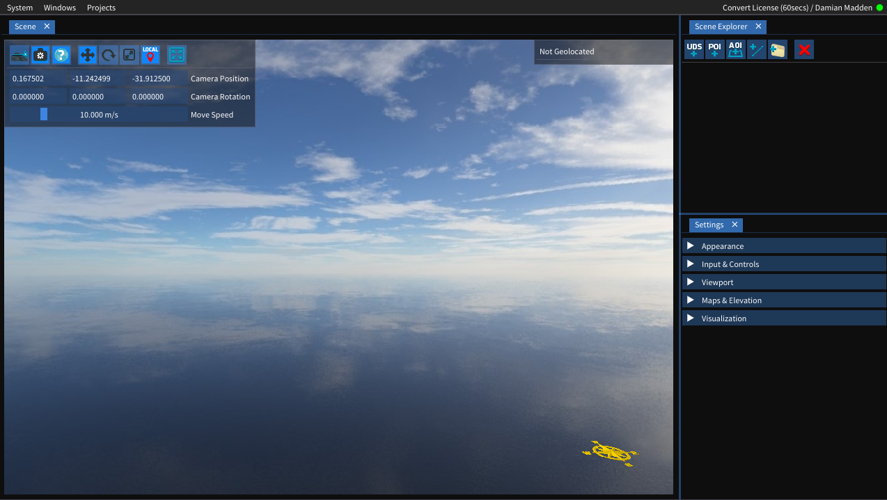

> TIP: If the system reports a username or password error, ensure you have entered the credentials correctly. The system is case-sensitive and does not accept spaces before or after the Server URL and login credentials.

## Vault Client Interface

Use the Euclideon Vault Client Interface to view, import, and convert 3D models. Refer to the sections that correlate to the numbers on the image for more detailed information on how to use that feature. 

We are only touching on the elements you need to start using Euclideon Vault Client. Refer to the [**Euclideon Vault Client User Guide**](./UserGuide.md) for detailed coverage of the Euclideon Vault Client interface.

[**1. Menu and Status Bar**](#menu-and-status-bar)  
[**2. Scene Viewport**](#scene-viewport)  
[**3. Scene Explorer**](#scene-explorer)  
[**4. Settings**](#settings)  
[**5. Convert Tab**](#convert)  
 

### MENU AND STATUS BAR 

The menu bar consists of 2 sections, the left section with menu drop downs and the right section with status information. The status information will change depending on what models are loaded.

#### System Menu  

The **System** menu has a number of system related functions:

- `Logout` terminates your current session with the server and takes you back to the login screen. Logging out prevents attackers from potentially hijacking your session and enables you to change users or servers.

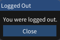

> TIP: Logout does not unlock your current licenses for use by other users, they must still time out.

- `Restore Defaults` resets all settings back to how they were when you ran Euclideon Vault Client the first time.
- `About` displays a popup with the version and license information for the current version of Client.
- `Release Notes` displays a popup with information on the current and previous release changes.
- `Quit` logs you out and then closes the program.

#### Windows menu  

The Windows menu allows you to show (tick) or hide (untick) the `Scene`, `Scene Explorer`, `Settings`, and `Convert` windows in the Euclideon Vault Client application.

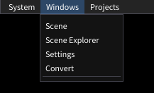

>TIP: If you notice missing functionality, be sure to enable the required screen panels.

#### Projects menu  

Use the projects menu to manage project viewing.

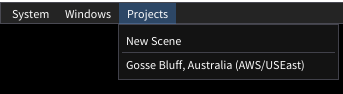

- **New Scene** will remove all items from your Scene and create a new empty Scene.
- **Export** will export the project information, including links to models and other features, to a GeoJSON (JavaScript Object Notation) file in a user-specified directory. The directory must exist.
- **Import** will enable you to import a project in UDP or GeoJSON (JavaScript Object Notation) format to the Scene.
- **Projects** list of available projects on your Euclideon Vault Server.

>TIP: You can also **drag and drop** a UDP or GeoJSON file onto the Euclideon Vault Client interface to load a project.

### SCENE VIEWPORT

When you load a model or project, it will display in the scene viewport. You can manoeuvre within the scene display using the mouse or the keyboard.

#### Default Mouse Controls

| Action | Description |
| :--- | :----------------------- |
| **Tumble** | Hold down the `left-mouse` button and move the mouse left-right-up-down to rotate within the display and change the angle of your view. You will not travel with the tumble action. |
| **Pan** | Holding the `right mouse` button on a point in the scene (not the skybox) will begin "panning" (moving the camera, but not turning the camera. It will keep the originally hovered point _under the mouse cursor_. |
| **Orbit** | Hold down the `mouse scroll wheel` as you move the mouse. The mouse movement will give you the sensation that you are orbiting around the point you selected. This feature is based on where you first click on the screen and will keep the camera the same distance from the clicked point by turning and moving the camera. |
| **Dolly** | The `mouse scroll wheel` will "dolly" (zoom the camera in and out) from the point where the mouse is hovering (will not work with the skybox). |

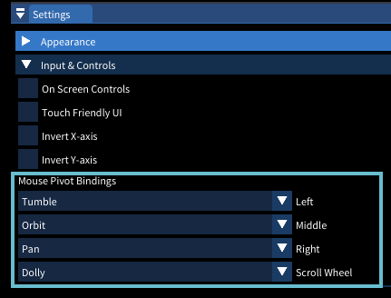

#### Default Keyboard Controls

You can use specific keys, with the "Scene" window focused, to control the camera movement.  

| Action | Description |
| :--- | :----------------------- |
|**W** and **S** |manoeuvre the camera forward and backward at the current Camera Move Speed.|
|**A** and **D** |pan the camera left and right at the current Camera Move Speed.|
|**R** and **F** |ascend and descend the camera at the current Camera Move Speed.|
|**Spacebar** |locks altitude, allowing you to pilot the camera without changing the camera's height (Z-axis lock).|
>TIP: Hold the `Ctrl` key while pressing `W`, `S`, `A`, `D`, `R`, or `F` keys to dramatically slow the camera movement. 
>Hold the `Shift` key while pressing the `W`, `S`, `A`, `D`, `R`, or `F` keys to speed up the camera movement.

### SCENE EXPLORER 

The Scene Explorer window lists the assets currently in your scene. When you first open the Euclideon Vault Client interface, there should be no items listed. In order to familiarise yourself with the Euclideon Vault Client interface, you can load an existing UDS model or select a sample project if you are an Euclideon Earth subscriber. We cover both methods in this chapter.

#### Loading existing UDS Models
The easiest way to load a model into the Euclideon Vault Client is to **DRAG** a UDS file from your file explorer and **DROP** it in the Euclideon Vault Client Scene window to add the model to the scene.

Another way is to use the **Quick Action Menu** buttons across the top of the Scene Explorer to add or remove from the scene.

| Button | Description |
| :--- | :----------------------- |
|**Add UDS**  |  This button opens the dialog box to add a UDS model to the scene.  The Path/URL can include files on the local drives, network drives, UNC Paths, HTTP, HTTPS, FTP & FTPS.  (hotkey `Ctrl + U`) 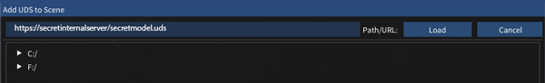  |
| **Delete**  |  This deletes all selected items from the scene  (hotkey `Delete`)  |

#### Loading a sample project
If you are a subscriber to Euclideon Earth, Euclideon provides sample projects for application evaluation. 

| Step | Action |
| :--- | :----------------------- |
|**1.** |To load a sample project, select **Projects** from the top menu.|
|**2.**	|Click a **Sample Project** from the dropdown list.   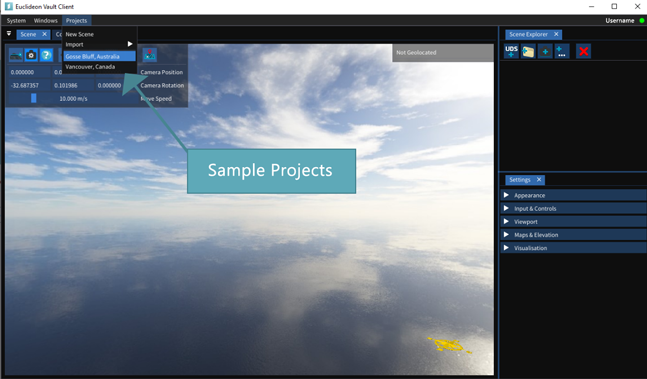  |
|**3.**|The sample project should load.   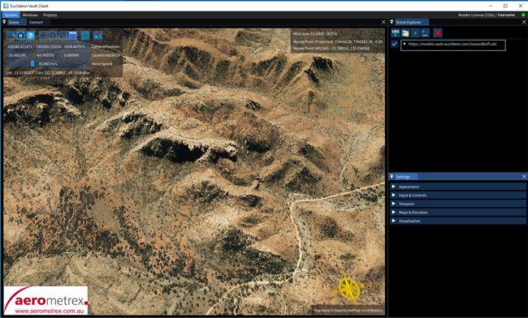 |

  
### SETTINGS

You can customise settings such as speed of movement, panel brightness, camera lens, and more. This section will cover the most common customised settings. Refer to the more detailed [**Euclideon Vault User Guide**](./UserGuide.md) for information on the other options in the Settings panel.

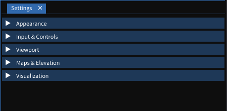

Use the parameters in the **Settings** window to customise how the Euclideon Vault Client looks and operates:
-   Change the  [**viewport camera**](#viewport) values 
-   Manipulate the [**maps & elevation**](#maps-and-elevation) settings

We recommend familarising yourself with each setting by altering the parameters individually to see how they affect the display and operation.  

>TIP: To restore all default values for any of these settings, simply right-click on the subheading and then select `Restore Defaults`.

#### Viewport

The Viewport allows you to adjust the camera's viewing distance and field of view (fov) of the camera lens. These settings affect your viewing range within the **Scene Window**.

Please note that Viewport parameters do not work in `Map Mode` (Ctrl+M).

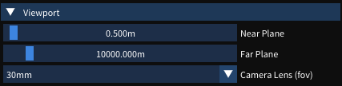

  > TIP: If the model disappears from the scene, yet you can still see the sky, watermark, or a (list of) uds file(s) in the Scene Explorer, your View Distance might be set too low. Adjust the View Distance settings until your models are visible again.

| Parameter  | Default Value| Description  |
| :--- | :------ | :----------------------- |
| **View Distance**     | 10000.000m  | The distance that the camera's view extends. |
| **Camera Lens (fov)** | 30mm | The Camera Lens (fov) operates like standard cameras. Use the field of view (fov) to alter the visual angle of the camera lens.  Select from the values in the drop down box. The shorter focal length (i.e. 15mm) gives a wider field of view than a larger length (i.e. 70mm).       

   
#### Maps and Elevation

The map feature is useful when you need a geospatial view and are unfamiliar with the area or are looking for a specific reference point.
Select **Map &amp; Elevation** within the **Settings** tab.

> TIP: Hold down the Ctrl-key and click in any parameter that has a slide bar to manually set a more precise value or set a value outside the parameter boundaries.
 

| Parameter  | Default Value | Description |
| :--- | :--- | :----------------------- |
| **Map Tiles**  | checked | As long as the 3D models are geospatially correct, suitable map tiles will generate automatically. If you uncheck the box, the map tiles (street map) below the model (and all other customisable options in Maps &amp; Elevation) will disappear.   |
|**Mouse can lock to maps** | checked | Check this box to enable the mouse to lock to map tiles when moving the camera. It also allows you to add interest points, measurements, and lines to the map tile, and execute other right-click functionality, such as setting the map height to the current mouse position.|
| **Tile Server** | | Tile Server allows overlay with existing maps, clicking `Tile Server` prompts you to enter a server address for retrieving background map tiles.    |
| **Map Height**  | 0.000m                | If you adjust Map Height, the map tile will move higher or lower according to your selection. The higher the value, the  more the map will cover the model. Couple with the overlay option to see where map markers cross the terrain image. |
| **Blending**   | Hybrid  | Choose from three options:   ` Hybrid`  Hybrid-map will move above and below the model as you adjust the map height.    `Overlay` Overlay-map will stay above the terrain image as you adjust the map height.   `Underlay`  Underlay-the map will stay below the terrain image as you adjust the map height. |
| **Opacity**   | 1   | The transparency (opacity) slider adjusts the transparency (opacity) of the map tiles so they don't obscure the visibility of objects in the scene. Move the blue bar to adjust the transparency of the map enabling you to view street markers over the terrain map.   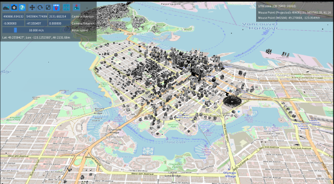|
| **Set to Camera Height**  | N/A  | The `Set to Camera Height` button can be used to set the height of the map tiles to the camera's current height. This can be used to place map tiles outside the default range of the slider of +/-1000m. |

### CONVERT

The Euclideon Vault Client enables users to import 3D models and convert them to Euclideon's Unlimited Detail format (UDS). Euclideon's UDS format enables you to stream and load massive point cloud data sets. Euclideon Vault currently supports the following file types:

-   LAS
-   PTS
-   PTXS
-   TXT/CSV
-   E57
-   XYZ
-   OBJ
-   ASC (Esri)

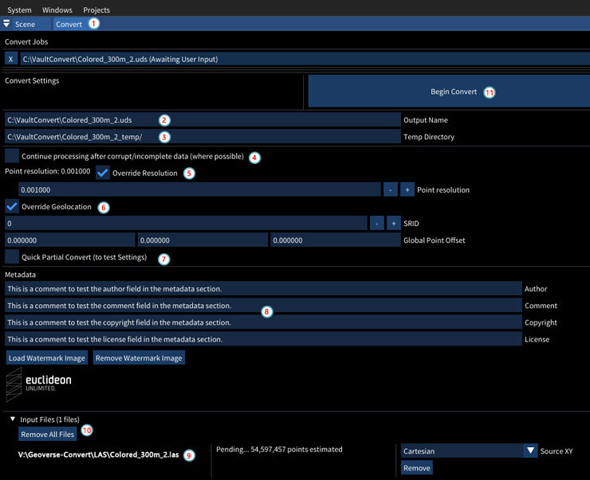

>TIP: If you attempt to drag and drop the file to want to convert on to the Convert Window before typing in the `Output Name` path and filename, then Euclideon Vault Client will report that the file type is not supported.

| Step | Action | Comments|
| :--- | :------------ | :-------------------------- |
| **1.** | Select the **Convert** tab in the Euclideon Vault Client interface | If the convert table is not visible, select **Convert** from the Windows drop down menu in the top left-hand corner of the Euclideon Vault Client interface. |
| **2.** | Type in the **Output Name**&mdash;path and name&mdash;of the exported UDS file. | Ideally, this parameter should be the final target location of the file so that you don\'t need to copy the file at the end. The system will add the file extension for you. Make sure there is enough space in the target directory to store the entire converted file. |
| **3.** | **Type in the Temp Directory** | Defaults to the same location as the output file in the previous step.   Type C:\\Vault\\convert in the Output Name field and the Temp Directory will default to C:\\Vault\\convert_temp. Euclideon recommends setting the Temp Directory location to one that resides on a high-speed local drive with plenty of space (***rule of thumb:*** set aside as much space as the uncompressed raw input, as the points in the temporary files have not as yet been compressed), as the convert process will write many small, temporary files.   The conversion will remove the temp directory after completion. |
| **4.** | Optional Selection: **Continue processing after corrupt/incomplete data (where possible)**. | If corrupt or incomplete data is detected during a conversion, this setting will decide whether the conversion is **cancelled (unticked) or continues (ticked)** resulting in a skip of the corrupted points. NOTE: If you tick this setting, the system will not report that it found corrupt or incomplete data. |
| **5.** | Optional Selection: **Point resolution:0.00000&mdash;Override** | Set to the source size, or it will default to 0.01 if no source size configured. This setting determines the size of the points (in metres) in the point cloud after conversion. It will attempt to find a good size based on the source data but can be set manually by first ticking the \"Override\" checkbox and then typing a value in the text field. |
| **6.** | Optional Selection: **Override Geolocation** | If the source data has been correctly geolocated, when you import that file prior to converting it, the file should already have the "Spatial Reference Identifier" (SRID) information filled in this box: search for "EPSG code" or "SRID code" in the metadata.   The **SRID** is the Geotagged ID of the GIS zone for the exported model.  If the pre-parse can detect the SRID it will be set automatically. If not, and you wish to correctly geolocate your data, then you can manually select the \"Override\" checkbox and enter the correct SRID in the text field. It assumes that the input is already in the correct zone.   **Global Point Offset** can be used to add an offset to the x, y and z coordinates of the converted model from that which was specified in the file's metadata, or if not, from the global origin (0, 0, 0). |
| **7.** | **Quick Partial Convert** | Enabling this option will greatly speed-up the conversion process by only processing 1 in every 1000 points of the input data. This is useful for testing and calibrating the conversion settings before attempting to convert a large and time-consuming job.  When imported into the scene the converted model will appear disintegrated and will have 1/1000th of the intended resolution. |
| **8.** | **Metadata** | This section allows you to import watermark by drag and dropping, add metadata related information such as Author, Comments, Copyright and License holders. |
| **9.** | **Choose a file to convert** | Drag and drop the file from Windows Explorer onto the **Convert** window.  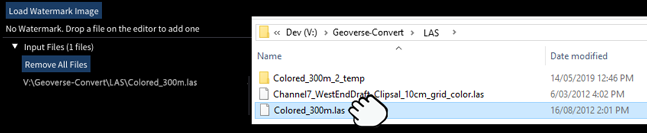   |
| **10.** | Look at the **Input Files** panel. | Once you have selected your file for conversion, a new panel appears listing your selected files. The estimated number of points in each file will be shown. During conversion, the progress for each file will also be shown. Click **Remove** or **Remove All Files** if the wrong file\(s\) was selected. | 
| **11.** | Click **Begin Convert** | Euclideon Vault will read the file then process and write the points.  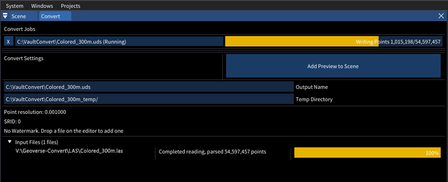  |
| **12.** | **X** to Cancel | The "X" button beside the convert job in the "Convert Jobs" section allows you to cancel a running convert (it will cancel at the next 'safe' point and clean up temporary files). Once cancelled, the 'Begin Convert' button and the configuration options will reappear enabling you to restart the conversion.   After a job has completed the "X" button also allows you to remove it from the list. |
| **13.**| Click **Add to Scene** | When the conversion has completed successfully, click the **Add to Scene** button located at the top of the window. Euclideon Vault Client interface will automatically switch to the **Scene Window** to display your 3D model. *NOTE: Requires a Render License.*     |
| **14.**| Review your 3D Model | If Euclideon Vault Client interface does not switch automatically to the **Scene Window**, then select **Scene** from the Windows menu at the top of the Euclideon Vault Client interface.  *NOTE: Requires a Render License.*|

> TIP: Euclideon does not recommend running multiple converts at the same time. Converting is a memory and processor intensive process so it's almost always faster to have 1 convert running at a time. Euclideon Vault Client helps with this by allowing you to queue multiple jobs to run one after another.

## Hosting a model

You can store 3D models on:

-   A local computer hard-drive

-   A network drive

-   In a Cloud.
    
>Detailed configuration and implementation instructions on how to host models in a cloud is outside the scope of this document. Please, refer to the Euclideon Server and VDK Guides for more information.

## Euclideon Vault Development Kit

The Vault Development Kit (\"VDK\") will allow businesses to utilise the features of the Vault ecosystem to enhance existing products, or create new ones. Information created via VDK can be accessed through other VDK enhanced products allowing seamless integration across multiple products.

The VDK provides access to the patented Unlimited Detail renderer, approved through the Vault Server licenses for 3rd party applications.

The VDK is a complex topic aimed at experienced Developers. You can request software developer-level technical information from Euclideon via email at <sales@euclideon.com>.

You must sign a Software Development Agreement, which sets out guidelines for developers.

## Contact Us

To learn more about Euclideon Vault and other Euclideon solutions,
please email <sales@euclideon.com> or visit us at [https://www.euclideon.com](https://www.euclideon.com/).

## Special Acknowledgements

Thank you to AEROmetrex for supplying the Gosse Bluff sample model. AEROmetrex provides aerial mapping services and products to our clients by exploiting both existing and emerging air and ground imaging technologies.

The award winning company specialises in aerial photogrammetry and offers a growing range of aerial orthophotography products, precision digital surface and terrain modelling, 3D models and value-added geospatial services.

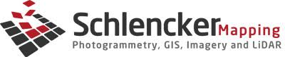

Schlenker Mapping was established in 1984 with the objective of providing service oriented, specialised digital photogrammetric and terrestrial surveys, as well as conventional aerial surveys. Today, Schlencker Mapping operates softcopy photogrammetric workstations providing one of the largest photogrammetric production capacities of any mapping organisation in Australia.
